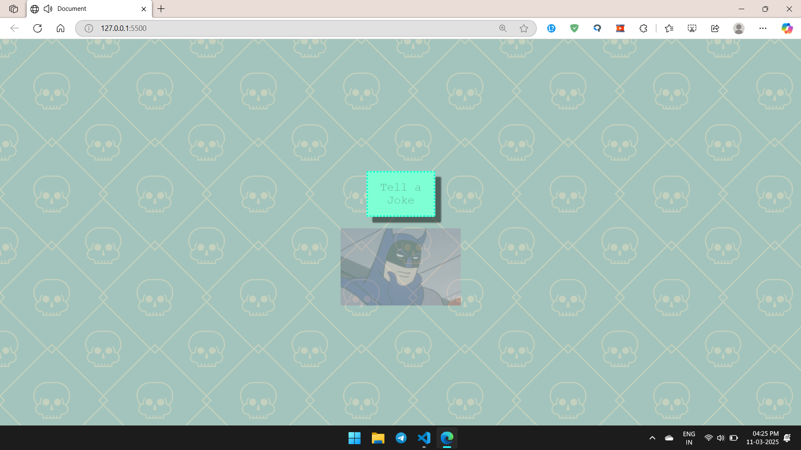

# Joke Website with Text-to-Speech 🎭🔊

A fun web application using **HTML, CSS, and JavaScript** that fetches jokes from an API and converts them to speech!

## 🚀 Features

- 🤣 **Joke API Integration:** Fetch jokes dynamically from an API to keep content fresh and humorous.
- 🎤 **Text-to-Speech Conversion:** Convert jokes into spoken words, adding an interactive and engaging element.
- 🌐 **Accessibility:** Enhance accessibility by catering to users with visual impairments who can listen to jokes.
- 🎯 **Learning Tool:** Improve pronunciation and language understanding through interactive listening.

## 🎬 Demo Video

[🔗 Click to Watch the Demo](https://drive.google.com/file/d/1xFvLHPv32J7APcAGSbkrIOJDnePC-P_e/view?usp=sharing)

## 📸 Preview



## 🤝 Contributing

Contributions are welcome! 🎉 Feel free to fork the repository and submit a pull request with your improvements.

## 📜 License

This project is licensed under the MIT License.

## 📥 Installation

Clone the repository and open `index.html` in your browser:

```bash
git clone https://github.com/your-username/repository-name.git
cd repository-name


